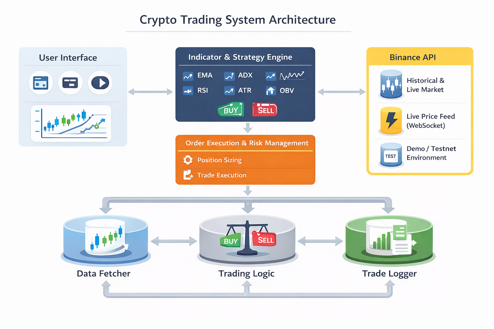

<div align="center">

# Crypto Trading Bot



### Automated cryptocurrency trading system with real-time analysis

[](https://python.org)
[](https://streamlit.io)
[](https://binance.com)

</div>

---

## Features

<table>
<tr>
<td width="50%">

### Real-Time Analysis
- Live market data streaming
- Technical indicator calculations
- Multi-timeframe analysis
- Signal generation engine

</td>
<td width="50%">

### Smart Trading
- Automated position management
- Risk-based position sizing
- Stop-loss & take-profit
- Trade execution logging

</td>
</tr>
<tr>
<td width="50%">

### Secure & Reliable
- Binance API integration
- Testnet & mainnet support
- Credential management
- Error handling & recovery

</td>
<td width="50%">

### Interactive Dashboard
- Real-time price charts
- Performance metrics
- Trade history tracking
- System status monitoring

</td>
</tr>
</table>

---

## Architecture

The system follows a modular architecture with clear separation of concerns:

```
┌─────────────────────────────────────────────────────────┐
│                    Streamlit UI Layer                    │
│                  (app.py - Dashboard)                    │
└────────────────────┬────────────────────────────────────┘
                     │
        ┌────────────┴────────────┐
        │                         │
┌───────▼────────┐       ┌───────▼────────┐
│   Services     │       │   Strategy     │
│                │       │                │
│ • Data Feed    │◄─────►│ • Indicators   │
│ • Trading      │       │ • Signals      │
│ • Position Mgr │       │ • Risk Mgmt    │
│ • Logger       │       │                │
└───────┬────────┘       └───────┬────────┘
        │                        │
        └────────────┬───────────┘
                     │
            ┌────────▼────────┐
            │  Binance API    │
            │  (Testnet/Live) │
            └─────────────────┘
```

---

## Quick Start

### Prerequisites

```bash
Python 3.8+
Binance API credentials
```

### Installation

```bash
# Clone repository
git clone <repository-url>
cd trading-crypto

# Install dependencies
pip install -r requirements.txt
```

### Configuration

Create `.streamlit/secrets.toml`:

```toml
BINANCE_TESTNET_API_KEY = "your_testnet_key"
BINANCE_TESTNET_API_SECRET = "your_testnet_secret"

# Optional: Production credentials
BINANCE_API_KEY = "your_mainnet_key"
BINANCE_API_SECRET = "your_mainnet_secret"
```

### Run

```bash
streamlit run app.py
```

---

## Project Structure

```
trading-crypto/
├── app.py                      # Main Streamlit application
├── config.py                   # Configuration settings
├── architecture.png            # System architecture diagram
├── requirements.txt            # Python dependencies
│
├── services/                   # Core services layer
│   ├── binance_data.py        # Market data fetching
│   ├── binance_trade.py       # Trade execution
│   ├── position_manager.py    # Position tracking
│   └── logger.py              # Logging utilities
│
├── strategy/                   # Trading strategy layer
│   ├── indicators.py          # Technical indicators
│   ├── signals.py             # Signal generation
│   └── risk.py                # Risk management
│
└── storage/                    # Data persistence
    └── settings.json          # User settings
```

---

## Strategy Components

### Technical Indicators
- **EMA (Exponential Moving Average)**: Trend identification
- **RSI (Relative Strength Index)**: Momentum analysis
- **MACD**: Trend strength & direction
- **Bollinger Bands**: Volatility measurement
- **Volume Analysis**: Market participation

### Signal Generation
- Multi-indicator confirmation
- Trend alignment verification
- Volume validation
- Risk-reward assessment

### Risk Management
- Dynamic position sizing
- Account balance protection
- Maximum risk per trade limits
- Stop-loss automation

---

## Dashboard Features

<div align="center">

### Real-Time Monitoring

| Metric | Description |
|--------|-------------|
| **Balance** | Current account balance |
| **P&L** | Profit/Loss tracking |
| **Win Rate** | Success percentage |
| **Active Trades** | Open positions |
| **Signal Status** | Current market signals |

</div>

---

## Configuration

Edit `config.py` to customize:

```python
SYMBOL = "BTCUSDT"           # Trading pair
INTERVAL = "15m"             # Timeframe
RISK_PER_TRADE = 0.02        # 2% risk per trade
MAX_POSITION_SIZE = 0.1      # 10% max position
```

---

## Security

- API keys stored in Streamlit secrets
- Never commit credentials to repository
- Use testnet for development
- Implement proper error handling
- Monitor API rate limits

---

## Logging

Two-tier logging system:

- **Strategy Logger**: Signal generation, indicator calculations
- **Execution Logger**: Trade execution, position updates

Logs stored in `logs/` directory with rotation.

---

## Development

### Adding New Indicators

```python
# strategy/indicators.py
def calculate_new_indicator(df):
    # Your indicator logic
    return df
```

### Adding New Signals

```python
# strategy/signals.py
def check_new_signal(df):
    # Your signal logic
    return signal_detected
```

---

## Performance Optimization

- Efficient data caching
- Minimal API calls
- Optimized indicator calculations
- Real-time WebSocket connections
- Async operations where possible

---

## Disclaimer

**This bot is for educational purposes only.**

- Cryptocurrency trading carries significant risk
- Past performance doesn't guarantee future results
- Always test on testnet first
- Never invest more than you can afford to lose
- Use at your own risk

---

## Contributing

Contributions welcome! Please:

1. Fork the repository
2. Create feature branch
3. Commit changes
4. Push to branch
5. Open pull request

---

## License

This project is open source and available under the MIT License.

---

<div align="center">

### Built with

Python • Streamlit • Binance API • Plotly • Pandas

**Made for the crypto community**

</div>
